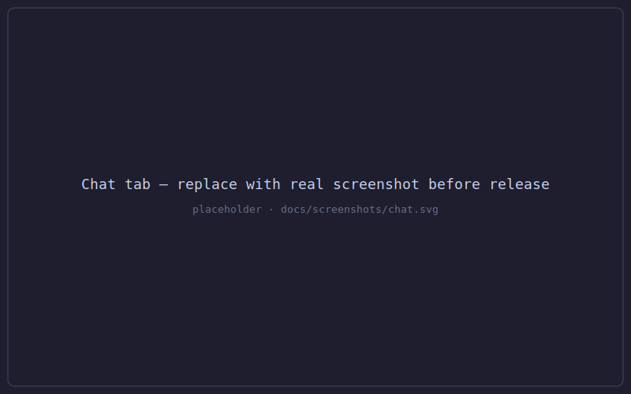
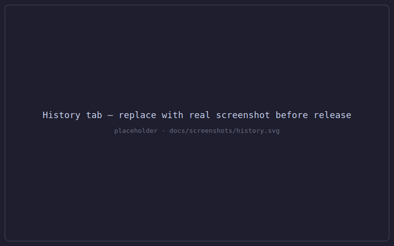

# cq

`cq` is a TypeScript web UI for the [Claude Agent SDK](https://www.npmjs.com/package/@anthropic-ai/claude-agent-sdk).
It runs on [Bun](https://bun.sh) with a React 19 front-end and communicates
exclusively over WebSocket — no REST endpoints for application data. Point it
at a working directory and it gives you a **Chat tab** for live, streaming
interaction with Claude and a **History tab** for reviewing, replaying, and
exporting past sessions. State is persisted to a local SQLite database; the
server is designed for local or trusted-network use only.

## Prerequisites

- [Bun](https://bun.sh) ≥ 1.3.13
- An `ANTHROPIC_API_KEY` environment variable (or a `~/.anthropic` credential
  file recognised by the Claude Agent SDK)
- For Codex sessions that need the cq ledger MCP tools (`mcp__cq__*`):
  the `cq-mcp` stdio binary must be resolvable. `bun install` links it
  into `node_modules/.bin/cq-mcp` via the `@cq/cq-mcp` workspace
  package; the server's `CodexBridge` walks the `node_modules/.bin`
  chain at session start to find it. If `cq-mcp` is missing on `PATH`
  the Codex CLI will report a spawn error when the model first calls
  one of the `mcp__cq__*` tools.

## Nix

A hermetic Nix build is provided. After pushing the repo, run directly without
cloning:

```sh
nix run github:<owner>/cq -- --cwd /path/to/project --port 5173
```

Or build locally and inspect the closure:

```sh
nix build .#default
./result/bin/cq --cwd /path/to/project --port 5173
```

The build fetches all npm dependencies (including the 228 MB
`@anthropic-ai/claude-agent-sdk-linux-x64` native binary) via a
fixed-output derivation keyed on the `bun.lock` hash.  The native
binary is therefore included in the closure — no runtime `npm install`
or network access required.

> **Platform note:** the hermetic package is restricted to `x86_64-linux`
> because the Claude Agent SDK ships a Linux-only native binary.  On other
> platforms the `nix run` command will fail at evaluation with a clear error;
> the `nix develop` devShell is still available on all platforms.

The web frontend is bundled at server start-up (first request) and cached
under `$XDG_CACHE_HOME/cq/web-dist` (default: `~/.cache/cq/web-dist`).
Override the cache location with the `CQ_WEB_OUTDIR` environment variable.

## Install

```sh
git clone <repo-url> cq
cd cq
bun install
```

## Run commands

```sh
# Production: builds the static bundle then serves it.
# Set --cwd to the directory you want the agent to work in.
bun run start --cwd /path/to/project

# Development: Bun.serve with HMR enabled — edits to packages/web/src
# are reflected in the open browser tab without a full page reload.
bun run dev --cwd /path/to/project
```

Both commands bind to `127.0.0.1:5173` by default and open the UI at
`http://localhost:5173`.

## Tabs

### Chat



The Chat tab sends a user message to the Claude agent and streams the
response back in real time. Tool-use events (file reads, shell commands,
`AskUserQuestion` prompts) surface inline as the agent works. A stop button
cancels the in-flight request; the session is saved to SQLite on completion.

### History



The History tab lists all past sessions ordered by start time. Select any row
to open a detail view showing the full message transcript, per-turn timing,
and a one-click export to JSONL. Sessions can be resumed or deleted.

## CLI flags

All flags are optional; the defaults are shown.

| Flag | Type | Default | Description |
|------|------|---------|-------------|
| `--cwd <path>` | string | `process.cwd()` | Working directory for the agent |
| `--host <host>` | string | `127.0.0.1` | Bind address |
| `--port <port>` | integer | `5173` | Bind port (1–65535) |
| `--db <path>` | string | `./var/db/cq.sqlite` | SQLite database file path |
| `--dev` | boolean flag | `false` | Enable HMR dev server |
| `--shutdown-timeout-ms <ms>` | integer | `5000` | Graceful-shutdown timeout in ms |
| `--help` | — | — | Print usage and exit |

## Dependencies

| Package | Version | Role |
|---------|---------|------|
| `bun` | 1.3.13 (flake-pinned) | Runtime, bundler, test runner |
| `typescript` | ^5.7.3 | Type checker |
| `react` | 19.2.6 | UI framework |
| `react-dom` | 19.2.6 | DOM renderer |
| `react-markdown` | ^10.1.0 | Markdown rendering in chat |
| `remark-gfm` | ^4.0.1 | GitHub-flavoured Markdown extension |
| `shiki` | ^3.0.0 | Syntax highlighting (12-language allow-list) |
| `zod` | 4.4.3 | Schema validation (shared package) |
| `@anthropic-ai/claude-agent-sdk` | 0.3.150 | Claude agent query / streaming |
| `eslint` | ^9.28.0 | Linter |
| `prettier` | ^3.5.3 | Formatter |

## Known limitations

**Attachment cap (F-11):** File attachments are capped at 5 MB per file,
enforced by the shared Zod schema. Uploads exceeding this limit are rejected
with a validation error before reaching the agent.

**Background-tab heartbeat throttling (F-09 / R14):** Browsers throttle
`setInterval` for inactive tabs, which would cause heartbeat misses on the
WebSocket connection. The client compensates by deferring the heartbeat check
with `setImmediate` when the tab is hidden. Re-focusing the tab triggers an
immediate probe. This mitigation covers common desktop browsers; some mobile
browsers apply more aggressive throttling that may still cause disconnects.

**`AskUserQuestion` status (F-02 / `PR-31-D01`):** The agent SDK exposes an
`AskUserQuestion` tool that lets Claude pause and request clarification. The
implementation uses Candidate A: it injects a synthetic `tool_result` message
into the streaming-input queue to relay the user's answer back to the agent.
This path is validated against a `MockQuery` in the test suite. The real SDK
native binary (`@anthropic-ai/claude-agent-sdk-linux-x64`) was unavailable
in the development environment, so the injection path has not been exercised
against the live subprocess. If a future deployment confirms Candidate A is
rejected by the real binary, the fallback is to add `AskUserQuestion` to
`Options.disallowedTools` (Candidate C), which silently disables the tool.
The `defects.md` entry `PR-31-D01` tracks this item.

**No authentication:** `cq` is designed for local or trusted-network use only.
Do not expose the bound port to the public internet.

**Screenshot placeholders:** The images under `docs/screenshots/` are SVG
placeholders. Replace them with real screenshots captured from a running
instance before final release.
